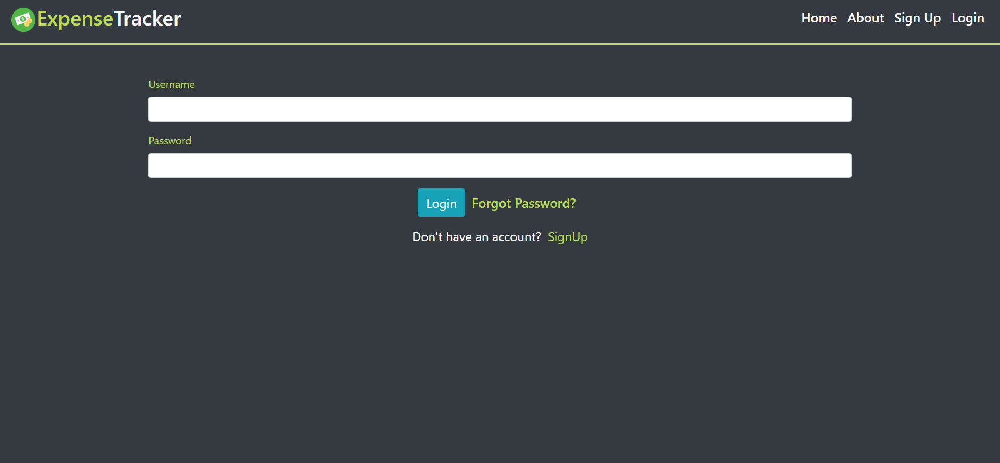
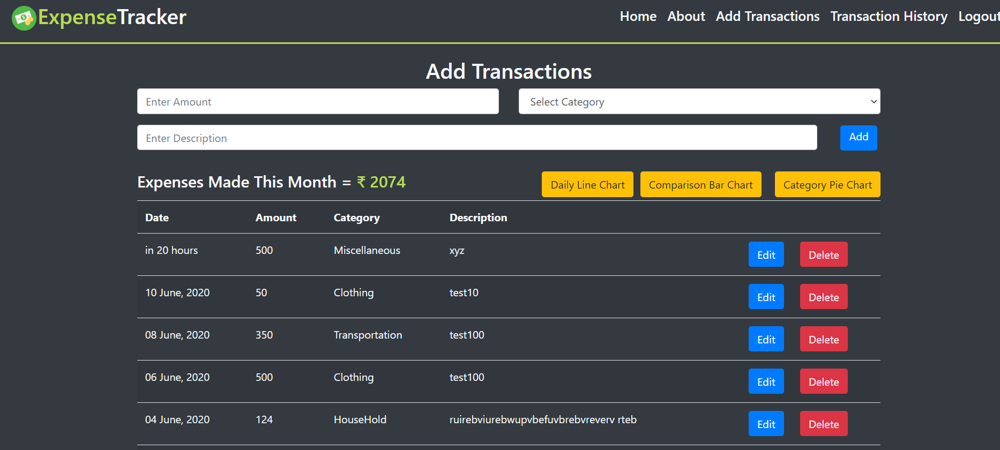

# Expense Tracker

> This app helps you track your daily expenses.You can feed in your expenses in this app and refer to the expenses you
> made throughout the day,month and even year.
> It gives you a month-wise total of your expenses and helps you compare your monthly expenses.

## Requirements

```
A version of python
pip package manager installed
Local instance of MySQL running on localhost as user root
Set MySQL password as an environment variable as 'MYSQL_PWD'
Run queries.sql
```

```bash
pip install flask
pip install mysqlclient
pip install flask-mysqldb
pip install flask-WTF
pip install passlib
```

## Quick Start

```bash
# Clone the repository
git clone https://github.com/KavishShah09/Expense-Tracker.git
```

## Go to the directory where you cloned the repository

> Run

```bash
python app.y
```

Runs the app in the development mode.<br />
Open [http://localhost:5000](http://localhost:5000) to view it in the browser.

# Info

> In this website,a user can signup and feed in his daily expenses and keep a track of it.The user can see the history of his expenses and filter them on the basis of month and year.The user can also visualise the data using the graphs provided.If the user,forgets the password,he can also change his password based on his email.A mail will be sent to the users address and the user can change the password by clicking on the link provided in the mail.

> Mobile Responsive


# Overview Of The Website

<p align="center">Sign Up Page</p>
<p align="center">
 
</p>

<p align="center">Login Page</p>
<p align="center">
 
</p>

<p align="center">Add Transaction Page</p>
<p align="center">
 
</p>

<p align="center">Transaction History Page</p>
<p align="center">
 
</p>

<p align="center">Category Wise Pie Chart For Current Year</p>
<p align="center">
 
</p>

<p align="center">Comparison Between Current Year And Previous Year Transactions</p>
<p align="center">
 
</p>

<p align="center">Daily Line Chart for Current Month</p>
<p align="center">
 
</p>

## In collaboration with:

- [Kavish Shah](https://github.com/KavishShah09)
- [Yash Jhaveri](https://github.com/yashjhaveri05)
